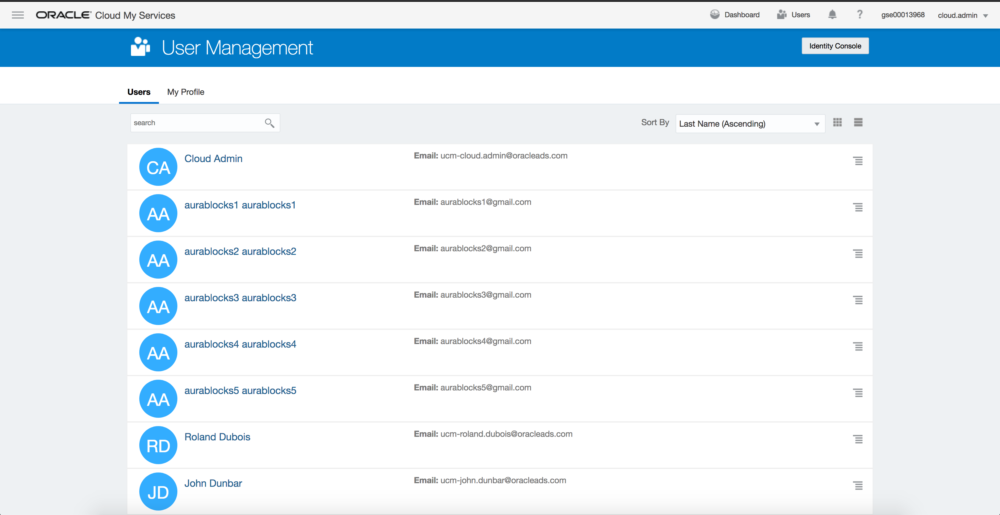
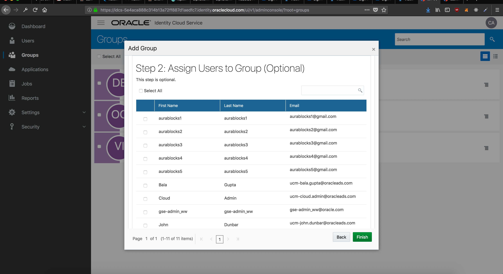
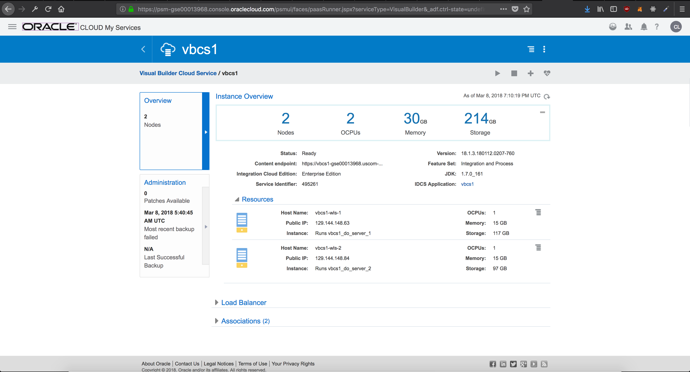
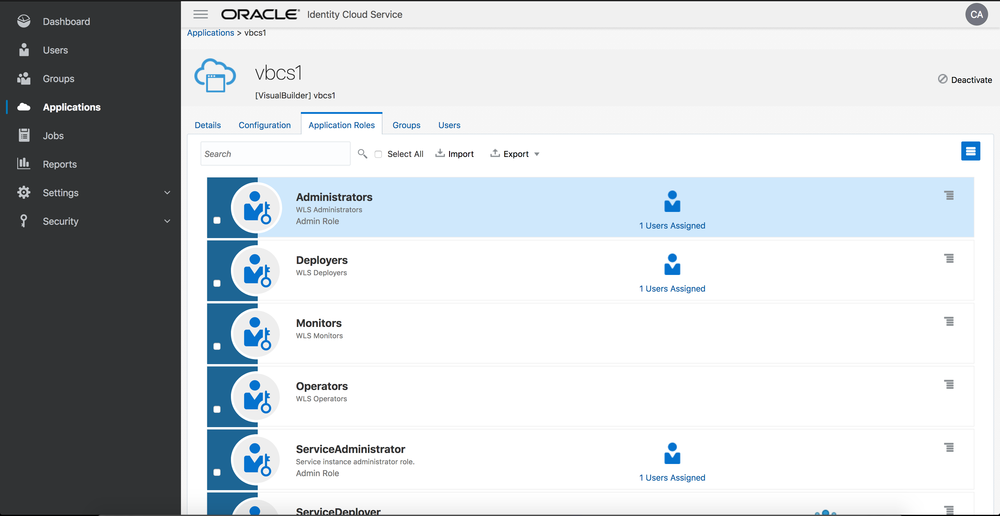
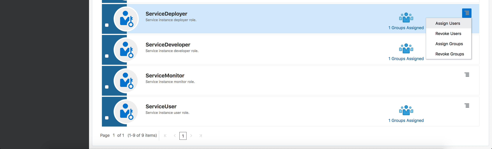
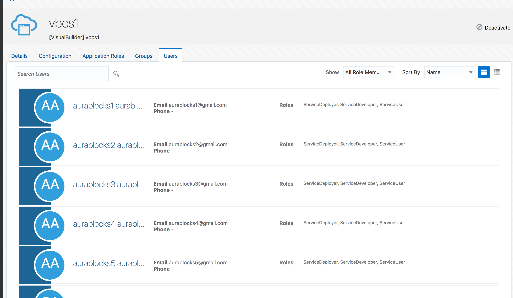

# How to Add Users to Oracle Visual Builder

---
## First Create Users

- We are going to want to first create five users to have access to this shared cloud instance.
---
## Then We Create a Group

- Make sure to add each of the five users you just created to this group.
---
## Navigate Inside Visual Builder Instance

- Navigate to this page from the Applications tab on the left and then click **IDCS Application: vbcs1** to get inside the instance.
---
## Now We Assign the Group We Made

- Navigate to **Application Roles** tab.

- Click on the hamburger menu and **assign groups** to the actions you want the group we created to have acces to.
- Follow the prompts.
---
## Make sure it worked!

- Navigate to the users tab to see the users we created in the beginning now have access.
